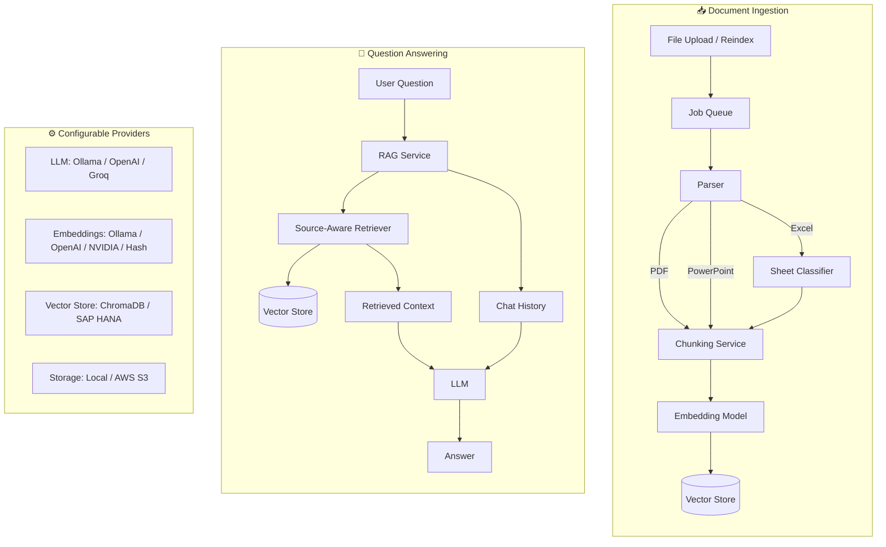

# Python RAG Learning

A FastAPI-based retrieval-augmented generation (RAG) application. Upload documents, index them into a vector store, and ask questions about their contents using an LLM.

## Features

- **Multi-format parsing** — Excel (.xlsx/.xls/.xlsm), PDF, PowerPoint (.pptx/.pptm)
- **Semantic chunking** — LLM-powered document splitting by meaning (with rule-based fallback)
- **Excel classification** — Automatically detects structured vs. unstructured spreadsheets
- **Async processing** — Background job queue for uploads and reindexing
- **Flexible LLM backends** — Ollama (local), OpenAI, or Groq
- **Flexible embeddings** — Ollama, OpenAI, NVIDIA, or deterministic hash
- **Multiple vector stores** — ChromaDB (local/HTTP) or SAP HANA Cloud
- **Multiple storage backends** — Local filesystem or AWS S3
- **Session-based chat** — Follow-up questions use conversation history
- **Source-aware retrieval** — Retrieves relevant context across all indexed files

## System Architecture



## Quick Start

### Prerequisites

- Python 3.9+
- [Ollama](https://ollama.com/) (for local mode — pull models below)

```bash
ollama pull gemma4
ollama pull nomic-embed-text
```

### Install & Run

```bash
# Clone and enter the project
git clone <repo-url> && cd python-rag-learning

# Create virtual environment
python3 -m venv venv
source venv/bin/activate

# Install dependencies
pip install -r requirements.txt

# Configure (edit .env with your settings)
cp .env.example .env

# Start the server
uvicorn main:app --reload
```

The API is available at **http://127.0.0.1:8000**. Interactive docs at [`/docs`](http://127.0.0.1:8000/docs).

On first startup, the app indexes all files in storage. If the vector store already has data, it skips reindexing.

### CLI Mode

```bash
python3 main.py
```

Type `q` to quit the interactive chat loop.

## API Reference

All routes are prefixed with `/ai`.

| Method | Endpoint | Description | Response |
| --- | --- | --- | --- |
| `POST` | `/ai/chat` | Ask a question about indexed documents | 200 — answer |
| `POST` | `/ai/upload` | Upload a file (async indexing) | 202 — job accepted |
| `GET` | `/ai/files` | List files in storage | 200 — file list |
| `DELETE` | `/ai/files` | Delete one or more files | 200 — deletion result |
| `POST` | `/ai/reindex` | Rebuild the entire vector store | 202 — job accepted |
| `GET` | `/ai/jobs` | List all background jobs | 200 — job list |
| `GET` | `/ai/jobs/{job_id}` | Get status of a specific job | 200 — job status |

### Usage Examples

**Upload a file** (returns immediately with a job ID):

```bash
curl -X POST http://127.0.0.1:8000/ai/upload \
  -F "file=@report.pdf"
```

```json
{"job_id": "abc-123", "filename": "report.pdf", "path": "data/report.pdf", "status": "queued"}
```

**Poll job status:**

```bash
curl http://127.0.0.1:8000/ai/jobs/abc-123
```

```json
{"job_id": "abc-123", "status": "complete", "type": "index", "filename": "report.pdf", "indexed_records": 42, "created_at": "...", "completed_at": "..."}
```

**Ask a question:**

```bash
curl -X POST http://127.0.0.1:8000/ai/chat \
  -H "Content-Type: application/json" \
  -d '{"question": "What internships are available?"}'
```

```json
{"session_id": "uuid-here", "question": "What internships are available?", "answer": "Based on the documents..."}
```

**List files:**

```bash
curl http://127.0.0.1:8000/ai/files
```

**Delete files:**

```bash
curl -X DELETE http://127.0.0.1:8000/ai/files \
  -H "Content-Type: application/json" \
  -d '{"filenames": ["report.pdf", "old-data.xlsx"]}'
```

**Reindex all files:**

```bash
curl -X POST http://127.0.0.1:8000/ai/reindex
```

## Project Structure

```
python-rag-learning/
├── api/routes/
│   ├── chat.py              # Question-answering endpoint
│   ├── delete.py            # File deletion endpoint
│   ├── files.py             # File listing endpoint
│   ├── jobs.py              # Background job status endpoints
│   └── upload.py            # Upload and reindex endpoints
├── core/
│   └── config.py            # Environment-based settings
├── models/
│   └── schemas.py           # Pydantic request/response models
├── services/
│   ├── chunking_service.py  # Semantic + rule-based document chunking
│   ├── classifier_service.py # Excel sheet structure classification
│   ├── embed_service.py     # Vector store management and retrieval
│   ├── excel_service.py     # Excel file parsing
│   ├── file_service.py      # File storage helpers
│   ├── hash_embedding_service.py # Deterministic hash embeddings
│   ├── job_queue.py         # Background job processing
│   ├── pdf_service.py       # PDF parsing
│   ├── ppt_service.py       # PowerPoint parsing
│   ├── rag_service.py       # LLM chain and chat sessions
│   ├── storage_service.py   # Local and S3 storage backends
│   └── vectorstore_service.py # ChromaDB and HANA backends
├── aws/                     # Example IAM and bucket policies
├── data/                    # Local file storage (default)
├── scripts/                 # Utility scripts (S3 smoke test)
├── tests/                   # Unit tests
├── main.py                  # FastAPI app entry point
├── requirements.txt
├── CONFIGURATION.md         # Full environment variable reference
└── .env.example             # Template configuration
```

## Configuration

The app is configured via environment variables in `.env`. The key mode switches are:

| Setting | Options | Controls |
| --- | --- | --- |
| `LLM_MODE` | `local` / `hosted` | Which LLM answers questions |
| `EMBEDDING_MODE` | `local` / `custom` / `hosted` | How text becomes vectors |
| `CHUNKING_MODE` | `local` / `hosted` | How documents are split |
| `FILE_STORAGE_BACKEND` | `local` / `s3` | Where files are stored |
| `VECTOR_DB_BACKEND` | `chroma` / `hana` | Where vectors are stored |

See **[CONFIGURATION.md](CONFIGURATION.md)** for the complete variable reference with defaults and examples.

## Testing

```bash
# Activate virtual environment
source venv/bin/activate

# Run all tests
python -m unittest discover -s tests
```

Tests use fake clients and do not require external services or AWS credentials.

### S3 Smoke Test

Verifies that your AWS credentials can upload/download/delete from the configured bucket:

```bash
venv/bin/python scripts/s3_upload_smoke_test.py
```

## Storage Backends

| Backend | Config | Notes |
| --- | --- | --- |
| **Local** | `FILE_STORAGE_BACKEND=local` | Files in `data/` directory |
| **AWS S3** | `FILE_STORAGE_BACKEND=s3` | Syncs to local cache for parsing. Example policies in `aws/`. |

## Vector Store Backends

| Backend | Config | Notes |
| --- | --- | --- |
| **ChromaDB local** | `CHROMA_MODE=local` | Persists to `chrome_langchain_db/`. No external services needed. |
| **ChromaDB HTTP** | `CHROMA_MODE=http` | Connects to a remote Chroma server. Set `CHROMA_HOST`/`CHROMA_PORT`. |
| **SAP HANA Cloud** | `VECTOR_DB_BACKEND=hana` | Requires `hdbcli` and `langchain-hana`. Set `HANA_DB_*` vars. |

## License

MIT
